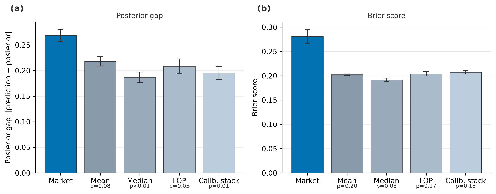

# Pnyx

[](https://github.com/HrishiKabra/pnyx/actions/workflows/ci.yml)
[](LICENSE)
[](https://doi.org/10.5281/zenodo.21602213)

### When Do Prediction Markets Beat Static Pools? A Controlled Stress Test of LLM Belief Aggregation

Pnyx is a synthetic information environment with a Bayes-optimal posterior
known exactly, used to measure how much of the available information
independent static pooling and dynamic LMSR market trading each recover from
a pool of LLM agents.



On the main grid, the market's final price (posterior gap 0.269 ± 0.012) is
**farther** from the Bayes-optimal posterior than every static pool built from
the same agents' independently elicited beliefs — including the best of the
four, the median pool (gap 0.187). This is a reversal of the naive
expectation, and it is the headline result of the paper. A later
capability-axis extension (v2) refines it: the deficit shrinks to parity as
trader capability rises, and no tested tier's market beats its own pool.

## What this is

Each question has a binary latent state generated along with six
conditionally-independent signals of known accuracy, so the exact
Bayes-optimal posterior given any subset of signals can be computed in closed
form — an oracle to score mechanisms against, not just the realized outcome.
The same LLM agents, on the same evidence, are elicited twice per question:
once independently (feeding every static baseline) and once through a
3-round LMSR market. Comparing the two isolates the *mechanism* (pooling vs.
trading) from model knowledge and signal structure, which prior work on LLM
prediction markets does not separate. The result is a map of where markets
help, do nothing, or hurt, plus stress tests under model-error correlation,
adversarial capital, and wealth persistence.

Full write-up: [`docs/writeup.md`](docs/writeup.md). Pre-registered
hypotheses and protocol: [`SPEC.md`](SPEC.md). arXiv-style PDF:
[`paper/pnyx.pdf`](paper/pnyx.pdf) (build it yourself with `bash paper/build.sh`).

## Reproduce the paper

Regenerate every figure, table, and statistic from the released event logs —
no API key, no network calls, a few seconds:

```bash
pip install -e .
python -m pnyx.cli analyze-main --data-root data/main --configs pnyx/configs/main --out analysis_out
```

Rerunning the experiments themselves from scratch needs an `OPENROUTER_KEY`
in `.env` and costs about $0.75 total:

```bash
python -m pnyx.cli run --config pnyx/configs/main/<COND>.yaml
```

one condition at a time (`A`, `B1`, `B3`, `C`, `D_k1`, `D_k3`, `D_k10`,
`W_fixed`, `W_shuffled` — see `pnyx/configs/main/`). Runs are resume-safe. The
`D_k*` and `W_*` conditions replay Pass-1 beliefs from a source condition's
logs rather than re-eliciting them, so that source must exist first: `D_k*`
reads from `C`, `W_*` reads from `A`. The released `data/main/` already
contains both, so a fresh clone can run any condition standalone.

The v2 capability extension is released in-repo under `data/v2/`. Regenerate
its tables and figures (`tiers.md`, `herding.md`, `fig3`, `fig2_v2`) with no API
calls:

```bash
python -m pnyx.cli analyze-v2 --flash data/main/A --pro data/v2/A_PRO --luna data/v2/A_LUNA --out analysis_out/v2
```

Rerunning the two v2 tiers from scratch (about $3.06, needs `OPENROUTER_KEY`)
uses the configs under `pnyx/configs/v2/`:

```bash
python -m pnyx.cli run --config pnyx/configs/v2/A_PRO.yaml
python -m pnyx.cli run --config pnyx/configs/v2/A_LUNA.yaml
```

Run the test suite:

```bash
pytest -W error
```

384 tests pass, including exact-value LMSR/oracle checks and a kill-and-resume
replay test.

## Results at a glance

| Hypothesis | Result |
|---|---|
| H1 — market vs. static pools | **Reversed.** Market posterior gap 0.269 ± 0.012 vs. best static pool (median) 0.187; significant vs. median (p=0.005), log opinion pool (p=0.048), and calibrated stack (p=0.008), directional vs. mean pool (p=0.080). |
| H2a — mixed vs. homogeneous teams | **Replication.** Quality-matched mixed team beats the weakest homogeneous arm by Δ=−0.155 (p<0.001) and leads all three homogeneous arms in point estimate. |
| H2b — phase map (ρ vs. market deficit) | **Descriptive** (n=12, narrow ρ range 0.378–0.514): Spearman r_s = 0.280. Mixed team C (team-mean ρ=0.442) is the only condition where the market ever beats the mean pool (2 of 3 seeds); the lowest-ρ team overall, homogeneous A (ρ=0.398), still runs a market deficit every seed. |
| H3 — adversarial manipulation | Flip rate rises 0.317 → 0.358 → 0.392 as adversary bankroll goes 1× → 3× → 10×; Brier degrades 0.105 → 0.312. Adversary P&L is negative at every multiple (−$47 / −$143 / −$440) — the market taxes manipulation even as predictions flip. |
| H-wealth — persistent bankroll | **Slightly hurts.** Posterior gap worsens vs. per-question reset (Δ≈0.05–0.06, p≈0.03); no order-dependence (fixed vs. shuffled, p=0.74). |

Reliability: 5 parse failures across the whole main grid (tens of thousands
of LLM turns, ≤0.19% per model per condition — Table 2).

### Capability axis (v2 extension)

An exploratory, **not pre-registered** extension (run after the initial
release) re-runs condition A's two-pass protocol on the same 40 questions × 3
seeds across three homogeneous trader tiers — `flash` (condition A,
deepseek-v4-flash), `pro` (deepseek-v4-pro, a *same-family* knowledge-vs-trading
control), and `luna` (gpt-5.6-luna). Deficit = market gap − mean-pool gap
(positive ⇒ the market destroys information):

| Tier | Pool gap | Market gap | Deficit (market − pool) | Team ρ |
|---|---|---|---|---|
| flash | 0.218 | 0.269 | 0.051 [−0.001, 0.100] (p=0.080) | 0.398 ± 0.018 |
| pro | 0.227 | 0.224 | −0.003 [−0.048, 0.041] (p=0.377) | 0.378 ± 0.029 |
| luna | 0.191 | 0.192 | 0.002 [−0.046, 0.050] (p=0.451) | 0.283 ± 0.005 |

The deficit reaches **parity, not superiority**: at both capable tiers it
straddles zero, but no tier's market beats its own pool. Pro's pool is no
better than flash's (pool-gap difference 0.010 [−0.011, 0.030], p=0.289) while
its market gap improves (−0.044 [−0.098, 0.008] vs. flash), so the fix is
trading skill, not knowledge — and pro's ρ (0.378) matches flash's (0.398), so
capability acts independently of error correlation. A herding regression
(descriptive) shows flash weighting the running price more than either capable
tier (price-weight b2 = 0.045 [0.028, 0.060] vs. pro 0.010 [−0.000, 0.021],
luna 0.023 [0.011, 0.036]). See
[`analysis_out/v2/`](analysis_out/v2/) (`tiers.md`, `herding.md`, `fig3.png`,
`fig2_v2.png`) and [`docs/writeup.md` §6](docs/writeup.md).

Cost: the v1 main experiment cost $0.73 across all ledgers (released main grid
$0.7255, pilots not released here); the v2 extension added $3.06 ($0.45 A_PRO +
$2.61 A_LUNA), for **$3.79 total**.

## Repo map

```
pnyx/
  schemas.py        # all Pydantic models: Belief, Trade, event-log records
  market.py         # LMSR engine — pure functions, no I/O
  env.py            # generative environment + exact Bayes posterior oracle
  agents.py         # Agent protocol + deterministic zero-intelligence MockAgent
  providers.py      # OpenAI-compatible client: rate limits, retries, cost ledger
  prompts.py        # versioned prompt templates + fixed persona catalogue
  runner.py         # two-pass elicitation loop; kill-safe event log + resume
  baselines.py      # mean / median / log-opinion-pool / calibrated-stack pools
  dataset.py        # deterministic question dataset build/merge/verify
  analysis/         # mainrun, figures, tables, manipulation, pilot analysis
  cli.py            # run / status / build-questions / analyze-pilot / analyze-main
  configs/          # per-condition YAML (models, seeds, b, budget)
replay/             # optional Streamlit price-path replay app (extra "replay")
data/main/          # released P4 event logs (JSONL) backing every result above
datasets/           # frozen 40-question + 10-pilot-question JSONL datasets
analysis_out/       # figures, tables, stats.md regenerated by analyze-main
tests/              # pytest suite (392 tests)
```

Limitations — thin markets, the narrow achieved ρ range, prompt/liquidity
sensitivity, synthetic prose rendering, the single environment family, and the
exploratory capability axis — are discussed in full in
[`docs/writeup.md`](docs/writeup.md#7-limitations).

## Replay UI

An optional Streamlit app replays a single settled question live: the LMSR
price path against the Bayes-posterior oracle (with shaded round boundaries
and the outcome marker), the trade stream (adversary trades highlighted, with
a pre-attack price line for the `D_K*` conditions), and a per-agent herding
panel (each honest agent's own Pass-1 belief vs. its in-market stated belief
vs. the price it faced, by round). Every number is served by the tested,
Streamlit-free data layer `pnyx.analysis.replay`.

```bash
pip install -e ".[replay]"
streamlit run replay/streamlit_app.py
```

The sidebar selects condition → seed → question; the default data root is
`data/` (reading `data/main` and `data/v2`). Streamlit is an optional extra —
the core install and the test suite do not require it.

## Citing this work

If you build on this environment, protocol, or results, please cite:

> *When Do Prediction Markets Beat Static Pools? A Controlled Stress Test of
> LLM Belief Aggregation.* Pnyx project, 2026. Write-up: `docs/writeup.md`.

```bibtex
@software{kabra_pnyx_2026,
  author  = {Kabra, Hrishi},
  title   = {Pnyx: when do prediction markets beat static pools? A controlled
             stress test of LLM belief aggregation},
  year    = {2026},
  version = {1.0.0},
  doi     = {10.5281/zenodo.21602214},
  url     = {https://github.com/HrishiKabra/pnyx}
}
```

Machine-readable citation metadata: [`CITATION.cff`](CITATION.cff).

### Data and figures

Code is MIT-licensed (see [`LICENSE`](LICENSE)). The released event logs
(`data/main/`, `data/v2/`), the question dataset (`datasets/`), and the
figures under `analysis_out/` are licensed
[CC BY 4.0](https://creativecommons.org/licenses/by/4.0/).
